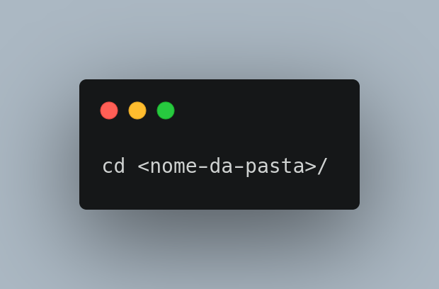
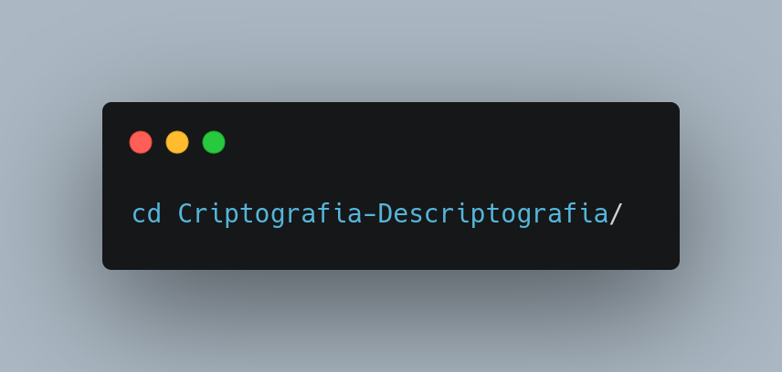
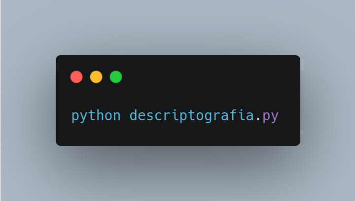

# Criptografia e Descriptografia em Python

## Resumo

Uma empresa quer transmitir dados por telefone, mas está preocupada com a possibilidade de seus telefones estarem grampeados. Ela pediu para você escrever um programa que criptografe os dados de modo que estes possam ser transmitidos mais seguramente. Todos os dados são transmitidos como inteiros de quatro dígitos. Você deve conseguir ler um inteiro de quatro dígitos inserido pelo usuário e criptografá-lo desta maneira: Substitua cada dígito pelo resultado da adição de 6 ao dígito e obtendo o resto depois da divisão do novo valor por 10. Troque então o primeiro dígito pelo terceiro e o segundo dígito pelo quarto. Então imprima o inteiro criptografado. Escreva um programa principal que receba como entrada um número inteiro de quatro dígitos criptografados e o descriptografe para formar o número original.

## Como rodar o código

Este código foi subdivido em duas partes, um código para criptografar e outro para descriptografar os dígitos de entrada do usuário. O código de criptografia é exportado para o código de descriptografia com o método “from <arquivo> import <função>”. Para rodar o programa, primeiramente a máquina terá que ter instalado python3, em seguida, após descomprimir a pasta “Criptografia-Descriptografia” os arquivos estarão no diretório “/Criptografia-Descriptografia” ao abrir a pasta diretamente em um terminal, clicando na pasta com o botão direito do mouse aparecerá a opção “abrir no terminal” , ou você pode abrir a pasta  utilizando o comando:

<<<<<<< HEAD

se a pasta “Criptografia-Descriptografia” estiver dentro do seu diretório home use:

=======

se a pasta “Criptografia-Descriptografia” estiver dentro do seu diretório home use:

>>>>>>> 06e704402b6e837966479e628eb8245210bd7a17

em seguida, para rodar o código use:

<<<<<<< HEAD

              
              ou 
              

=======
 ou

>>>>>>> 06e704402b6e837966479e628eb8245210bd7a17

dependendo do comando padrão para rodar o python3 na sua máquina o comando pode mudar.

Ao rodar o programa “descriptografia.py” ele pedirá para você inserir um número de 4 dígitos, ex: 1234, em seguida ele mostrará na tela o número criptografado, ex: 9 0 7 8, logo após ele pedirá para você inserir o número criptografado, ao inserir e dar 'enter', ele mostrará novamente o número descriptografado inserido no ínicio do programa, ex: 1234. Encerrado o programa.
